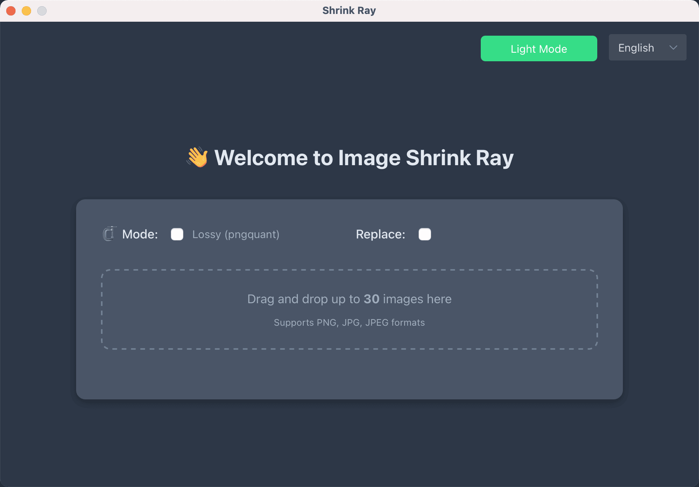

# 🔬 ShrinkRay

🌍 [English](./README.md) | [简体中文](./README.zh-CN.md)

**ShrinkRay** 是一款基于 **Tauri 2.0** 打造的本地图片压缩工具，快速、安全、高效，支持 **PNG（无损与有损）** 以及 **JPEG** 格式压缩。可并发处理最多 **5 张图片**（单张大小不超过 **20MB**），支持将压缩结果打包为 **ZIP 文件**。**所有处理均在本地完成，保障隐私安全。**

> ⚡ 本地运行，无需联网，安全可靠！

---

## 📷 截图

---

## 🧩 功能特点

- ✅ 支持 PNG（有损 / 无损）与 JPEG 格式压缩  
- 🚀 使用 `oxipng` 与 `pngquant` 实现高效压缩  
- 🧵 最多同时处理 5 张图片  
- 📁 单图最大支持 20MB  
- 📦 支持压缩结果 ZIP 打包  
- 🔐 所有操作本地执行，保障图片隐私  
- ⚡ 极速压缩，简单易用

---

## 📦 安装方式

前往 [发布页面](https://github.com/charles-lck/shrink-ray/releases) 下载适用于你系统的安装包，解压后直接运行即可。

> 🛠️ 本工具基于 [Tauri 2.0](https://v2.tauri.app/) 构建，开发需要搭建Tauri运行环境。

---

## 🚀 使用方法

打开应用后，将图片拖入界面，选择压缩设置，即可开始压缩！

---

## 🔧 使用的压缩引擎

- **PNG（无损）**：[`oxipng`](https://github.com/shssoichiro/oxipng)  
- **PNG（有损）**：[`pngquant`](https://github.com/kornelski/pngquant)  
- **JPEG**：基于高效 JPEG 编码器

---

## 🔐 安全性说明

本工具 **完全在本地运行**，不会将图片上传到任何服务器，适合用于处理隐私敏感内容，如设计稿、照片等。

---

## 📌 当前限制

- ⛔ 单张图片最大限制：20MB  
- ⛔ 最多支持 5 张图片同时压缩  
- ⛔ 当前仅支持 PNG 与 JPEG 格式

---

## 👨‍💻 作者

由 [Charles Luck](https://github.com/charles-lck) ❤️ 打造  
欢迎 Issue / PR / Star 支持项目发展！

## 📄 许可证

ShrinkRay 使用 [MIT 许可证](./LICENSE) 开源，支持个人与商业用途，欢迎自由使用与修改。
